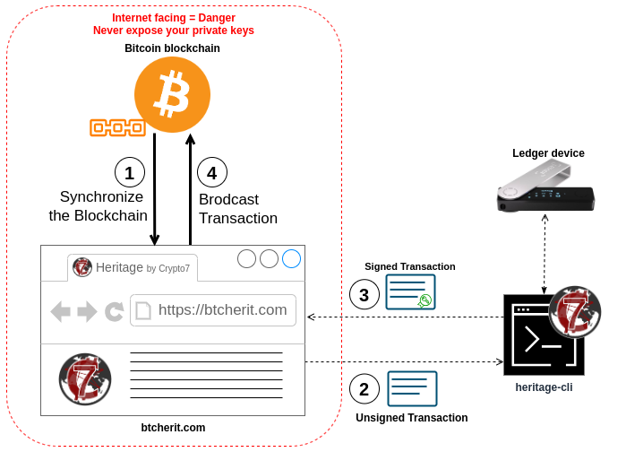

<!-- markdownlint-disable MD033 MD041 -->
<div id="top"></div>

<!-- PROJECT SHIELDS -->
<!--
*** I'm using markdown "reference style" links for readability.
*** Reference links are enclosed in brackets [ ] instead of parentheses ( ).
*** See the bottom of this document for the declaration of the reference variables
*** for contributors-url, forks-url, etc. This is an optional, concise syntax you may use.
*** https://www.markdownguide.org/basic-syntax/#reference-style-links
-->

[![Contributors][contributors-shield]][contributors-url]
[![Forks][forks-shield]][forks-url]
[![Stargazers][stars-shield]][stars-url]
[![Issues][issues-shield]][issues-url]
[![MIT License][license-shield]][license-url]

<!-- PROJECT LOGO -->
<br />
<div align="center">
  <a href="https://github.com/crypto7world/btc-heritage">
    
  </a>

  <h3 align="center">Heritage CLI</h3>

  <p align="center">
    A Rust CLI tool intended to manage an Heritage wallet.
    <br />
    <a href="https://btcherit.com"><strong>Explore the Heritage wallet service »</strong></a>
    <br />
    <a href="https://github.com/crypto7world/btc-heritage/issues">Report Bug</a>
  </p>
</div>

<!-- TABLE OF CONTENTS -->
<details>
  <summary>Table of Contents</summary>
  <ol>
    <li><a href="#about-the-project">About The Project</a></li>
    <li>
      <a href="#installation">Installation</a>
      <ul>
        <li><a href="#from-source">From source</a></li>
        <li><a href="#from-pre-compiled-binaries">From pre-compiled binaries</a></li>
      </ul>
    </li>
    <li>
      <a href="#usage">Usage</a>
      <ul>
        <li><a href="#create-a-new-wallet">Create a new wallet</a></li>
        <li><a href="#restore-a-wallet-from-seed">Restore a wallet from seed</a></li>
        <li><a href="#extract-extended-public-keys">Extract eXtended public keys</a></li>
        <li><a href="#retrieve-heir-public-key">Retrieve heir public key</a></li>
        <li><a href="#spending-coins">Spending coins</a></li>
      </ul>
    </li>
    <li><a href="#roadmap">Roadmap</a></li>
    <li><a href="#built-with">Built With</a></li>
    <li><a href="#minimum-supported-rust-version-msrv">Minimum Supported Rust Version (MSRV)</a></li>
    <li><a href="#license">License</a></li>
    <li><a href="#contact">Contact</a></li>
    <li><a href="#acknowledgments">Acknowledgments</a></li>
  </ol>
</details>

<!-- ABOUT THE PROJECT -->

## About The Project

The [`heritage-cli`] project provides a CLI tool to manages Bitcoin wallets.

It can interact with the [btcherit.com][heritage-wallet-service] service or manage everything locally (this is _Coming Soon_). On the private keys front, it can either manage them localy, or with the help of a [Ledger](https://www.ledger.com/) hardware-wallet device.

Here is the basic workflow between the **Bitcoin blockchain**, the [btcherit.com][heritage-wallet-service] service and the [`heritage-cli`]:

<div align="center">
    
    <p><i>This PNG can be edited using <a href="https://draw.io">Draw.io</a></i></p>
</div>

1. The [btcherit.com][heritage-wallet-service] service synchronize permanently with the Bitcoin blockchain;
2. From the service, you can see and manage your wallet, and create new _unsigned transactions_;
3. The [`heritage-cli`] sign those transactions using your private key(s), preferably managed on a [Ledger](https://www.ledger.com/) device;
4. From the service, you can broadcast the _signed transactions_.

If you don't have a [Ledger](https://www.ledger.com/) device, installing the [`heritage-cli`] on an air-gapped computer will give you a very secure setup because your private keys never need to "touch" the Internet, but on the other-hand making transactions is burdensome because you need to transfer them in and out of the air-gapped computer to sign them then broadcast them.

Another advantage of this setup is that you only have to verify/trust the [`heritage-cli`]: the [btcherit.com][heritage-wallet-service] service does not know your private keys and cannot steal your coin!

### Yeah, but I don't want to depend on an online service at all

And I understand! Be patient, and take a look at the roadmap: before the year is over, the CLI will provide synchronization capabilities with a Bitcoin node that you own, making it possible to manage your Heritage wallet entirely on your own!

### What is the added value of the service, once the CLI can fully operate on its own?

Using Taproot Bitcoin scripts to manage inheritance is only good as long as you don't forget to move your coins to "reset" the dead-man switch. The service is here to remind you of that, as well as making the operation easy or even seemless (for example, if you spend coins few months before the expiration of your deadman switch, the service will automatically use this transaction to "reset" it).

On the other hand if you are dead, the service will notify and help your heirs to retrieve the coins you left behind.

Of course you can take steps to do all that on your own, the service is simply here to ease the burden.

<p align="right">(<a href="#top">back to top</a>)</p>

<!-- INSTALLATION -->

## Installation

### From pre-compiled binaries

You can find precompiled binaries for the major platforms in the Release section of the repo:

[Latest version](https://github.com/crypto7world/btc-heritage/releases/latest) - [All releases](https://github.com/crypto7world/btc-heritage/releases)

If you wish to install the `v0.1.0-alpha` for Linux, you can run:

```shell
version="v0.1.0-alpha"
wget https://github.com/crypto7world/btc-heritage/releases/download/${version}/heritage-cli-${version}-x86_64-unknown-linux-gnu.tar.gz
tar xvzf heritage-cli-${version}-x86_64-unknown-linux-gnu.tar.gz
./heritage-cli # to verify it worked, should display usage instructions
```

### From source

To install a dev version of `heritage-cli` from sources, make sure you have Rust installed. You can use any method, just make sure to have the Minimum Supported Rust Version. Using [rustup.rs](https://rustup.rs/) is generally a winner:

```shell
curl --proto '=https' --tlsv1.2 -sSf https://sh.rustup.rs | sh
```

On Linux, you need to install the `libudev` package, for example on Ubuntu:

```shell
sudo apt-get install -y libudev-dev
```

Then clone this repo, `cd` into it and run cargo install:

```shell
git clone https://github.com/crypto7world/btc-heritage
cd btc-heritage
cargo install --bin heritage-cli --path crates/heritage-cli
export PATH="$PATH:$HOME/.cargo/bin" # Make sure cargo installation path is in your PATH
heritage-cli # to verify it worked, should display usage instructions
```

Alternatively you can just use `cargo build -r -p heritage-cli` and then copy the `heritage-cli` binary from the `target` directory to wherever you like.

<p align="right">(<a href="#top">back to top</a>)</p>

<!-- USAGE -->

## Usage

You can get help simply by running

```shell
heritage-cli help
```

Or, to get help about a specific command `heritage-cli help <command>`, for example:

```shell
heritage-cli help wallet create
```

```text
Creates a new Heritage wallet with the chosen online-wallet and key-provider

An Heritage wallet has two functional components: 
  - The "key-provider" is the component dedicated to key management. 
    It will be use mainly when creating a new wallet and each time you need to sign a Bitcoin transaction. 
    Its security is critical and using a Ledger device is recommended. 
  - The "online-wallet" is the component on which you can declare your Heritage Configuration, generate new Bitcoin addresses, synchronize with the blockchain and create new Unsigned transactions.

Usage: heritage-cli wallet create [OPTIONS]

Options:
[CLIP]
```

### Login to the service

The CLI will want to communicate with the [btcherit.com][heritage-wallet-service] service and needs to be authenticated.

```shell
heritage-cli service login
```

It will open a web-browser tab so you can login to the service and grant access to the CLI.

It is not a _mandatory_ step, but if you don't mind using the service, it will make your life **MUCH** easier.

### Create a new wallet using Ledger

Create a new wallet named _default_ that will use the [btcherit.com][heritage-wallet-service] service as `online-wallet` and a Ledger as `key-provider` by simply running:

```shell
heritage-cli wallet create
```

Make sure your Ledger device in plugged in and unlocked!

### Restore a wallet from seed with local private keys (no Ledger)

If you already have a mnemonic you would like to restore, for example `abandon abandon abandon abandon abandon abandon abandon abandon abandon abandon abandon about`:

```shell
heritage-cli wallet create --kp local --seed abandon abandon abandon abandon abandon abandon abandon abandon abandon abandon abandon about
```

<span style="color:red">**⛔ OBVIOUSLY DO NOT USE _THAT_ MNEMONIC TO CREATE YOUR BITCOIN WALLET ⛔**</span>

### Create a backup-access for your wallet and designate your wife as your heir

First create 2 wallets:

```shell
heritage-cli heir backup create --email <your-own-email>
heritage-cli heir wife create --email <your-wife-email>
```

Then set the Heritage Configuration of your wallet. As an example, this tells _"after 360 days without the coins moving, I want my backup wallet to be able to spend the coins, then 30 days later, I want my wife's wallet to be able to spend"_:

```shell
heritage-cli wallet heritage-config set --sh backup:360 --sh wife:390
```

As you can see, there is nothing really special about a _backup-access_. It is just a regular heir that happen to be yourself.

At this point, you can create addresses and start receiving coins:

```shell
heritage-cli wallet new-address
```

Last but not least, don't forget to save the seeds of the `backup` and `wife` heirs!!

```shell
heritage-cli heir backup backup-mnemonic
heritage-cli heir wife backup-mnemonic
```

The informations provided by these commands are all your heirs need to be able to spend your coins once you are not able to reset the deadman switch anymore. You can put those in sealed paper envelopes. It is safe, because as long as you don't loose your main access (and don't die), there is absolutely nothing anyone can do with these enveloppes.

### Spending coins

You can spend coins like this, in one line:

```shell
heritage-cli wallet send-bitcoin -r <address>:<amount> --sign --broadcast
```

The CLI will retrieve a new transaction from the service, show it to you, ask you if you want to sign it and then broadcast it. And that's it.

You can also decompose thoses steps. For reference, here is a script doing the same thing as our one line:

```shell
unsigned=$(heritage-cli wallet send-bitcoin -r <address>:<amount>)
signed=$(heritage-cli wallet sign $unsigned)
heritage-cli wallet broadcast $signed
```

<p align="right">(<a href="#top">back to top</a>)</p>

## Built With

[![Rust][rust-shield]][rust-url]

And based upon 3 Rust projects without which I would not have gotten that far:

- [`bdk`]
- [`rust-miniscript`]
- [`rust-bitcoin`]

Thanks.

<p align="right">(<a href="#top">back to top</a>)</p>

<!-- MSRV -->

## Minimum Supported Rust Version (MSRV)

This binary compile with Rust 1.79.0

<p align="right">(<a href="#top">back to top</a>)</p>

<!-- LICENSE -->

## License

Distributed under the MIT License. See [`LICENSE`][license-url] for more information.

<p align="right">(<a href="#top">back to top</a>)</p>

<!-- CONTACT -->

## Contact

John Galt - [@Crypto7W](https://twitter.com/Crypto7W) - <john@crypto7.world>

Though my real name is Jérémie Rodon ([LinkedIn][jr-linkedin-url], [GitHub][jr-github-url]), I operate this project under the pseudonym John Galt in reference to the character of _Ayn Rand_ novel [**Atlas Shrugged**](https://www.amazon.com/Atlas-Shrugged-Ayn-Rand-ebook/dp/B003V8B5XO) (and, yes, I obviously embrace John Galt philosophy).

Project Link: [https://github.com/crypto7world/heritage-cli][repo-url]

<p align="right">(<a href="#top">back to top</a>)</p>

<!-- ACKNOWLEDGMENTS -->

## Acknowledgments

- [`rust-miniscript`]
- [`rust-bitcoin`]
- [`bdk`]
- [Best Readme Template](https://github.com/othneildrew/Best-README-Template)
- [Img Shields](https://shields.io)

<p align="right">(<a href="#top">back to top</a>)</p>

<!-- MARKDOWN LINKS & IMAGES -->
<!-- https://www.markdownguide.org/basic-syntax/#reference-style-links -->

[heritage-wallet-service]: https://btcherit.com
[repo-url]: https://github.com/crypto7world/btc-heritage
[`heritage-cli`]: https://github.com/crypto7world/btc-heritage
[contributors-shield]: https://img.shields.io/github/contributors/crypto7world/btc-heritage.svg?style=for-the-badge
[contributors-url]: https://github.com/crypto7world/btc-heritage/graphs/contributors
[forks-shield]: https://img.shields.io/github/forks/crypto7world/btc-heritage.svg?style=for-the-badge
[forks-url]: https://github.com/crypto7world/btc-heritage/network/members
[stars-shield]: https://img.shields.io/github/stars/crypto7world/btc-heritage.svg?style=for-the-badge
[stars-url]: https://github.com/crypto7world/btc-heritage/stargazers
[issues-shield]: https://img.shields.io/github/issues/crypto7world/btc-heritage.svg?style=for-the-badge
[issues-url]: https://github.com/crypto7world/btc-heritage/issues
[license-shield]: https://img.shields.io/github/license/crypto7world/btc-heritage.svg?style=for-the-badge
[license-url]: https://github.com/crypto7world/btc-heritage/blob/master/LICENSE
[jr-linkedin-url]: https://linkedin.com/in/JeremieRodon
[jr-github-url]: https://github.com/JeremieRodon
[rust-shield]: https://img.shields.io/badge/Rust-000000?style=for-the-badge&logo=rust&logoColor=white
[rust-url]: https://https://www.rust-lang.org/
[`rust-miniscript`]: https://github.com/rust-bitcoin/rust-miniscript
[`rust-bitcoin`]: https://github.com/rust-bitcoin/rust-bitcoin
[`bdk`]: https://github.com/bitcoindevkit/bdk
